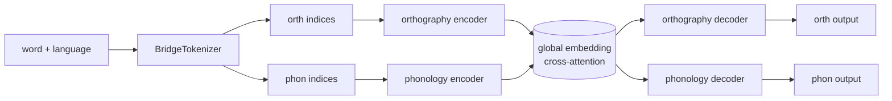

# BRIDGE

[](https://github.com/emelex-ai/BRIDGE/actions/workflows/ci.yml)
[](https://www.python.org/)
[](https://github.com/astral-sh/ruff)
[](#license)

A multilingual neural model of printed-word naming. **BRIDGE** maps orthographic and phonological representations of arbitrary length into a unified embedding via cross-attention, then decodes back into either modality. Multilingual lexicons (English, Spanish) and per-word language tagging are supported out of the box, enabling code-switching studies.

> [!NOTE]
> This repository ships the **core model and tokenizers** as an importable library. It does **not** contain experiment scripts, training configs, or datasets, those live in downstream research repos that depend on `bridge`.

---

## Quick start

```bash
git clone https://github.com/emelex-ai/BRIDGE.git
cd BRIDGE
uv sync
uv run python -c "from bridge import Model, BridgeTokenizer; print(BridgeTokenizer().encode('cat'))"
```

If `uv` is not installed: `curl -LsSf https://astral.sh/uv/install.sh | sh`.

---

## What's in here

```text
bridge/
├── core/                         # phonreps.csv + pronunciation_lexicons/{en,es}.json
├── domain/
│   ├── datamodels/               # pydantic schemas: ModelConfig, DatasetConfig, TrainingConfig, …
│   ├── tokenizer/                # BridgeTokenizer, PhonemeTokenizer, CharacterTokenizer, CUDADict
│   ├── data/                     # BridgeDataset
│   └── model/                    # Encoder, Decoder, Model
├── application/
│   ├── shared/                   # Singleton
│   └── training/                 # TrainingPipeline, ortho_metrics, phon_metrics
├── infra/                        # Optional integrations: GCS, W&B, metrics logger
└── utils/                        # device_manager, helpers
tests/                            # 87 tests covering tokenizers, dataset, model, metrics
```

---

## Public API

```python
from bridge import (
    Model, ModelConfig,
    BridgeDataset, DatasetConfig,
    BridgeTokenizer,
    TrainingPipeline, TrainingConfig,
    BridgeEncoding, EncodingComponent, GenerationOutput,
    MetricsConfig,
    VocabSpec,
)
```

> [!NOTE]
> `Model` and `BridgeTokenizer` are **sibling objects** — neither holds a reference to the other. The model needs vocab sizes and special-token IDs (to size embeddings and to know when to stop generating); these flow through `ModelConfig.vocab` (a `VocabSpec`). Use `VocabSpec.from_tokenizer(tokenizer)` to derive one in a single line.

Optional integrations (not re-exported at top level — import only if you use them):

```python
from bridge.infra.clients.wandb import WandbWrapper
from bridge.infra.clients.gcp.gcs_client import GCSClient
from bridge.infra.metrics import metrics_logger_factory
```

---

## Architecture



Four training pathways are supported on the `Model`: `o2p`, `p2o`, `op2op`, `p2p`. Selected via `TrainingConfig.training_pathway`.

---

## Multilingual support

The phoneme tokenizer loads per-language lexicons from `bridge/core/pronunciation_lexicons/` at construction. English and Spanish are shipped; additional languages can be supplied via the optional `custom_cmudict_path` argument using the same nested-by-language JSON shape.

```python
from bridge import BridgeTokenizer

tok = BridgeTokenizer()                                   # loads en + es by default
out = tok.encode(
    ["hola", "world"],
    language_map={"hola": "ES", "world": "EN"},           # per-word language tags
)
```

The character tokenizer prepends a language token (`"--"`, `"EN"`, or `"ES"`) before `[BOS]` for every input, so each batch is laid out as `[LANG, BOS, …chars, EOS, PAD, …]`.

> Each `BridgeDataset` word carries its own language. The pkl input format is columnar: `{"word_raw": [...], "language": [...]}`. Omitting the `language` column defaults every word to `"EN"`.

---

## Usage example (training pipeline)

```python
import torch
from bridge import (
    BridgeDataset, DatasetConfig,
    BridgeTokenizer,
    Model, ModelConfig,
    TrainingPipeline, TrainingConfig,
    VocabSpec,
)

# Tokenizer and dataset come first
tokenizer = BridgeTokenizer()
dataset = BridgeDataset(DatasetConfig(dataset_filepath="my_words.pkl"))

# Model is constructed from config alone — vocab info flows through ModelConfig.vocab
model_config = ModelConfig(..., vocab=VocabSpec.from_tokenizer(tokenizer))
model = Model(model_config)

# TrainingPipeline wires them together
pipeline = TrainingPipeline(model, dataset, TrainingConfig(...), wandb_wrapper=None)
pipeline.run_train_val_loop()
```

> [!IMPORTANT]
> The library does not provide a `Trainer` or YAML-based launcher. Downstream research repos compose these primitives into their own training scripts.

---

## Phonological representations

Phonemes are encoded against the feature table at [`bridge/core/phonreps.csv`](bridge/core/phonreps.csv) (31 distinctive features) augmented with 5 special tokens (`[BOS]`, `[EOS]`, `[UNK]`, `[SPC]`, `[PAD]`). Pronunciations are looked up from the bundled lexicons; for unknown words the tokenizer returns `None`.

The feature inventory is based on the phonological vectors from [Traindata](https://github.com/MCooperBorkenhagen/Traindata).

---

## Development

```bash
uv sync --group dev                      # install dev deps (ruff, mypy, pytest)
uv run pytest                            # tests
uv run ruff check bridge tests           # lint
uv run ruff format bridge tests          # format
uv run mypy                              # type-check (advisory)
```

CI runs `lint`, `typecheck` (advisory), and `test` jobs on every push and PR. See [`.github/workflows/ci.yml`](.github/workflows/ci.yml).

> GPU verification: BRIDGE is tested against PyTorch 2.12 + CUDA 13 (Blackwell / sm_120 supported). Run `python -c "import torch; print(torch.cuda.is_available())"` after `uv sync` to confirm.

---

## License

MIT — see project metadata in [`pyproject.toml`](pyproject.toml).
