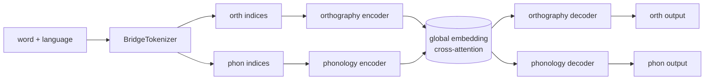

# BRIDGE

[](https://github.com/emelex-ai/BRIDGE/actions/workflows/ci.yml)
[](https://www.python.org/)
[](https://github.com/astral-sh/ruff)
[](#license)

A multilingual neural model of printed-word naming. **BRIDGE** maps orthographic and phonological representations of arbitrary length into a unified embedding via cross-attention, then decodes back into either modality. Multilingual lexicons (English, Spanish) and per-word language tagging are supported out of the box, enabling code-switching studies.

> [!NOTE]
> This repository ships the **core model and tokenizers** as an importable library. It does **not** contain experiment scripts, training configs, datasets, loggers, or cloud integrations, those live in downstream research repos that depend on `bridge`.

`docs/architecture.md` is the map of the system. Read it before changing anything structural.

---

## Quick start

```bash
git clone https://github.com/emelex-ai/BRIDGE.git
cd BRIDGE
uv sync
uv run python -c "from bridge import Model, BridgeTokenizer; print(BridgeTokenizer().encode('cat'))"
```

If `uv` is not installed: `curl -LsSf https://astral.sh/uv/install.sh | sh`.

Dependencies are torch, pydantic, pandas and numpy. Nothing else is installed.

---

## What's in here

```text
bridge/
├── core/                         # phonreps.csv + pronunciation_lexicons/{en,es}.json
├── domain/
│   ├── datamodels/               # pydantic schemas: ModelConfig, DatasetConfig, TrainingConfig, …
│   ├── tokenizer/                # BridgeTokenizer, PhonemeTokenizer, CharacterTokenizer
│   ├── data/                     # BridgeDataset
│   └── model/                    # Encoder, Decoder, Model
├── application/training/         # TrainingPipeline, ortho_metrics, phon_metrics
└── utils/                        # device_manager, get_project_root, set_seed
docs/decisions/                   # numbered, immutable architecture decision records
tests/                            # unit tests, the golden-master fixture, and bench_phon.py
```

---

## Public API

`bridge.__all__` is the supported surface. Everything under `bridge.application` and `bridge.domain` is internal layout a reorganisation is free to move, and [`tests/test_public_api.py`](tests/test_public_api.py) asserts that the exported names are enough to assemble and run a pipeline.

```python
from bridge import (
    Model, ModelConfig, PATHWAYS, Pathway,
    BridgeDataset, DatasetConfig,
    BridgeTokenizer, CharacterTokenizer, PhonemeTokenizer,
    TrainingPipeline, TrainingConfig, TrainingEvent, TrainingPhase,
    BridgeEncoding, EncodingComponent, GenerationOutput,
    PhonemeTable, load_phoneme_table,
    VocabSpec,
)
```

> [!NOTE]
> `Model` and `BridgeTokenizer` are **sibling objects** — neither holds a reference to the other. The model needs vocab sizes and special-token IDs (to size embeddings and to know when to stop generating); these flow through `ModelConfig.vocab` (a `VocabSpec`). Use `VocabSpec.from_tokenizer(tokenizer)` to derive one in a single line.

---

## Architecture


```mermaid
flowchart LR
    W["word + language"] --> T[BridgeTokenizer]
    T --> O[orth indices]
    T --> P[phon indices]
    O --> OE[orthography encoder]
    P --> PE[phonology encoder]
    OE --> X[(global embedding<br/>cross-attention)]
    PE --> X
    X --> OD[orthography decoder]
    X --> PD[phonology decoder]
    OD --> Yo[orth output]
    PD --> Yp[phon output]
```

Five pathways, listed in `bridge.PATHWAYS` and tabulated in [`docs/architecture.md`](docs/architecture.md): `o2p`, `p2o`, `o2o`, `p2p` and `op2op`. Any of them can train (`TrainingConfig.training_pathway`) or generate (`Model.generate(encoding, pathway)`).

---

## Two phoneme id spaces

The single easiest way to get silently wrong output. Both are `torch.long` and only naming separates them.

| space | range | indexes | where it appears |
|---|---|---|---|
| **row** | 0–90 | *which phoneme*, a row of the feature table | `EncodingComponent.enc_input_ids`, `Model.embed_phon_tokens` |
| **feature** | 0–35 | *which phonetic feature*, a column | `GenerationOutput.phon_tokens`, `PhonemeTokenizer.decode`, `VocabSpec.phon_*_id`, loss targets |

```python
from bridge import load_phoneme_table

table = load_phoneme_table()
table.row_of("AE")            # phoneme -> row id
table.features_of(row)        # row id -> its active feature columns
```

---

## Multilingual support

The phoneme tokenizer loads per-language lexicons from `bridge/core/pronunciation_lexicons/` at construction. English and Spanish are shipped; additional languages can be supplied via the optional `custom_cmudict_path` argument using the same nested-by-language JSON shape.

```python
from bridge import BridgeTokenizer

tok = BridgeTokenizer()                                   # loads en + es by default
out = tok.encode(
    ["hola", "world"],
    language_map={"hola": "ES", "world": "EN"},           # per-word language tags
)
```

The character tokenizer prepends a language token (`"--"`, `"EN"`, or `"ES"`) before `[BOS]` for every input, so each batch is laid out as `[LANG, BOS, …chars, EOS, PAD, …]`.

> Each `BridgeDataset` word carries its own language. The pkl input format is columnar: `{"word_raw": [...], "language": [...]}`. Omitting the `language` column defaults every word to `"EN"`.

---

## Usage example

```python
from bridge import (
    BridgeDataset, DatasetConfig,
    BridgeTokenizer,
    Model, ModelConfig,
    TrainingPipeline, TrainingConfig,
    VocabSpec,
)

# Tokenizer and dataset come first. Share one tokenizer across datasets: building a
# second re-parses the pronunciation lexicons.
tokenizer = BridgeTokenizer()
dataset = BridgeDataset(DatasetConfig(dataset_filepath="my_words.pkl"), tokenizer=tokenizer)

# The model is built from config alone; vocab info flows through ModelConfig.vocab.
model = Model(ModelConfig(d_model=64, nhead=2, vocab=VocabSpec.from_tokenizer(tokenizer)))

# Placement is yours. The pipeline follows the model, it does not move it.
model.to("cuda")

pipeline = TrainingPipeline(
    model=model,
    training_config=TrainingConfig(training_pathway="o2p"),
)

# The library owns the step; you own the loop. Which slices, how many epochs, when to
# shuffle, what to log and when to checkpoint are all yours. See docs/decisions/0013.
cutpoint = int(len(dataset) * 0.8)
train_slices = [slice(i, min(i + 32, cutpoint)) for i in range(0, cutpoint, 32)]
val_slices = [slice(i, min(i + 32, len(dataset))) for i in range(cutpoint, len(dataset), 32)]

for epoch in range(pipeline.start_epoch, 3):
    dataset.shuffle(cutpoint, seed=epoch)
    for event in pipeline.train_steps(dataset, train_slices, epoch):
        print(event.epoch, event.step, float(event.metrics["loss"]))

    # `evaluate` is the no-grad counterpart of `single_step`. Scoring is opt-in on the
    # training path because the metrics cost ~7 ms and ~12 extra device syncs per step.
    scores = [pipeline.evaluate(dataset, s) for s in val_slices]
    pipeline.save_checkpoint(f"epoch_{epoch}.pth", epoch, dataset=dataset)
```

> [!IMPORTANT]
> The library provides no `Trainer`, no YAML launcher, no metrics logger and no cloud client. Downstream research repos compose these primitives into their own training scripts and decide for themselves what to record and where.

---

## Phonological representations

Phonemes are encoded against the feature table at [`bridge/core/phonreps.csv`](bridge/core/phonreps.csv) (31 distinctive features) augmented with 5 special tokens (`[BOS]`, `[EOS]`, `[UNK]`, `[SPC]`, `[PAD]`). A phoneme's embedding is the mean of its active feature embeddings, never a free parameter of its own, so phonemes sharing features share embedding mass. Pronunciations are looked up from the bundled lexicons; for unknown words the tokenizer returns `None`.

The feature inventory is based on the phonological vectors from [Traindata](https://github.com/MCooperBorkenhagen/Traindata).

---

## Development

```bash
uv sync --group dev                      # install dev deps (ruff, mypy, pytest)
uv run pytest -q                         # tests
uv run ruff check bridge tests           # lint
uv run ruff format bridge tests          # format
uv run mypy                              # type-check
```

CI runs `lint`, `typecheck` and `test` on every push and PR. See [`.github/workflows/ci.yml`](.github/workflows/ci.yml).

[`tests/test_documentation.py`](tests/test_documentation.py) asserts the checkable claims in this file and in `docs/architecture.md` against the running system, so a structural change that outdates either one fails the suite rather than going unnoticed.

> GPU verification: BRIDGE is tested against PyTorch 2.12 + CUDA 13 (Blackwell / sm_120 supported). Run `python -c "import torch; print(torch.cuda.is_available())"` after `uv sync` to confirm.

---

## License

MIT — see project metadata in [`pyproject.toml`](pyproject.toml).
